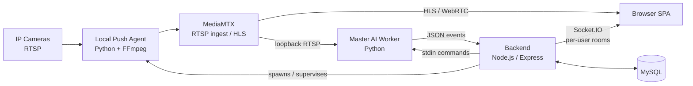

# 🎥 EdgeSafe AI CCTV System — Case Study

> **Real-time, multi-tenant video intelligence platform** that turns ordinary RTSP CCTV cameras into an AI-driven security and operations system: face recognition, person/vehicle tracking, loitering alerts, Bangla license-plate ANPR, fire/smoke detection, and industrial conveyor counting.

> 🔒 **EdgeSafe's source code is in a private repository.** This page is an architecture and engineering case study. Code walkthroughs are available on request.

---

## 🧭 TL;DR

| | |
|---|---|
| **Problem** | Enterprise VMS products (e.g. Milestone XProtect) charge per camera, and charge extra for AI add-ons. Small sites want smart alerts, not a 24/7 recording archive. |
| **Solution** | An analytics-first platform: watch cameras live, react instantly, and persist only what matters. |
| **My role** | Sole architect and engineer: system design, AI pipeline, backend, frontend, DevOps tooling. |
| **Scale target** | One commodity server, ~20 cameras, multiple isolated tenants. |
| **Cost model** | Zero licensing. Runs on a modest Windows, Linux or macOS box. |

---

## 🛠️ Tech Stack

| Layer | Technologies |
|---|---|
| **Languages** | **Python 3.12**, **JavaScript (ES2022, Node.js 20)**, **SQL (MySQL 8)**, **HTML5 / CSS3**, **Bash**, **Batch** |
| **Computer Vision / ML** | YOLOv8 (Ultralytics), ByteTrack, FaceNet (InceptionResnetV1 / VGGFace2), MediaPipe, EasyOCR (Bangla + English), OpenCV, PyTorch, NumPy |
| **Backend** | Node.js, Express, Socket.IO, JWT auth, MySQL |
| **Streaming** | RTSP, MediaMTX, HLS / WebRTC, FFmpeg |
| **Frontend** | Vanilla JS single-page app, hls.js, Leaflet maps, Canvas overlays |
| **Tooling** | Process orchestration scripts, Python-generated DOCX documentation, Git |

---

## 🏗️ Architecture

**Four cooperating processes plus a database:**

1. **MediaMTX**: RTSP ingest and HLS re-publishing.
2. **Backend (Node/Express/Socket.IO)**: auth, persistence, orchestration, and tenant-scoped event fan-out.
3. **Local Agent (Python/FFmpeg)**: bridges cameras on remote LANs into the central media server, with auto-reconnect.
4. **Master AI Worker (Python)**: one process, one thread per stream, running the whole detection stack.

---

## ✨ Capabilities

- **Live multi-camera grid** with WebRTC preferred and HLS fallback, plus per-camera detection overlays.
- **Face recognition** with 512-d FaceNet embeddings and cosine-similarity matching against per-user enrollments. Enrollments are hot-reloaded, so a new face is recognised within seconds without a restart.
- **Person and vehicle tracking** using YOLOv8 with ByteTrack for stable IDs.
- **Loitering detection** with configurable dwell time and spatial re-association across tracker ID switches.
- **Bangla license-plate ANPR**: plate localisation → Bangla and English OCR → per-track voting for stable reads.
- **Fire and smoke detection** with a custom YOLO model, plus a temporally-confirmed HSV fallback that suppresses static false positives.
- **Conveyor bag counting** (industrial use case) with a virtual tripwire.
- **Offline "Analyze Video"** module that runs the identical pipeline on uploaded clips and produces annotated MP4s.
- **Analytics**: heatmaps, per-camera / per-person / per-type breakdowns, person movement paths on a map.
- **Person categories**: standard / staff / VIP / visitor / threat.

---

## 🧠 Key Engineering Decisions

### 1. Decoupling capture from inference, which fixed "boxes 3–5 seconds behind reality"
OpenCV queues frames inside FFmpeg's decoder, so a slow consumer processes stale video, and the lag grows over time.
**Solution:** a dedicated reader thread per stream overwrites a single-slot buffer at native frame rate. The inference loop is time-throttled (~8 FPS) and always sees the *latest* frame. Old frames are dropped, so latency cannot accumulate.

### 2. One shared AI worker instead of one process per camera
Loading YOLO, FaceNet and OCR per camera would exhaust RAM and VRAM.
**Solution:** a single worker with a thread per stream, controlled over a stdin JSON protocol (`add / remove / bagline / quit`). Every model has its own lock to prevent cross-stream contention. The backend supervises the worker, and on a crash it respawns it and **replays state**, so the system is self-healing.

### 3. Multi-tenancy without multiple processes
Per-user enrollment directories map to per-user recognizers inside the same worker. Socket.IO rooms (`user:<id>`) isolate real-time events. Feature flags, incidents and snapshots are all ownership-checked. Tenants never see each other's faces, cameras or alerts.

### 4. Zero-trust local media path
Paths are registered as publisher endpoints, and the AI worker reads MediaMTX's **loopback re-stream** rather than the original camera URL. This gives low-latency, TCP-stable input even when the camera sits on a flaky remote LAN.

### 5. Reducing false positives through temporal and spatial confirmation
- Names must be confirmed across **N consecutive frames** in the same spatial bucket before they "stick".
- Tiny, low-resolution faces are shown as *unknown* rather than risk a wrong name.
- Fire heuristics require **hot-core + halo + flicker across 3 frames**, so warm walls and lighters don't trigger alarms.
- Person detections are filtered by confidence and relative area to suppress noise.

### 6. Data integrity for counters: state belongs in the database
Cumulative bag counts are stored as **per-minute buckets in MySQL**, bucketed on the **DB clock**. The AI worker holds no running total, so a worker crash and replay can never reset or double-count. "Reset" stamps a timestamp instead of deleting rows, which preserves throughput history.

---

## 🔬 Case Highlight: Data-driven algorithm selection (bag counting)

Counting identical cement bags on a loaded barge belt looked like a standard detect-and-track problem. I benchmarked two approaches against a hand-verified ground truth of **47 bags**. The truth was established by five independent tripwire positions that agreed to within ±1.

| Approach | Result | Why |
|---|:---:|---|
| Blob detection + nearest-centroid tracking | **13 / 47** | Bags arrive ~1.4 s apart. The tracker swaps IDs between neighbours, and touching bags merge into one blob. Output swung from 0 to 45 under a small threshold change, so it was tuning noise rather than signal. |
| **Occupancy "gate" counter with per-point median vote** | **47 / 47** | Needs no object identity. Each sample point counts independently, and the median tolerates a sloppily drawn line. |

Two earlier gate designs failed at **5/47** and **24/47**, and each failure led directly to the final design. The final design also refuses to count until it has actually observed contrast, so it cannot invent bags from sensor noise.

**Takeaway:** I choose the algorithm that survives the real environment, not the one that is fashionable, and I validate it against measured ground truth.

---

## 🔐 Security and Reliability

- JWT-authenticated REST and Socket.IO, with all routes protected except the minimum required for agent bootstrap.
- Strict ownership checks on cameras, snapshots and activity endpoints, and path-traversal protection on snapshot serving.
- Per-type incident throttling so high-volume events can't drown out critical ones (fire and smoke snapshot independently of face matches).
- Graceful lifecycle management: teardown removes the worker stream, agent process, media path and DB row together, so nothing leaks.
- Warm-restart bootstrap: the full stack is rebuilt from the database on backend boot.

---

## 📊 Positioning vs. Enterprise VMS

| | **This project** | **Enterprise VMS (e.g. XProtect)** |
|---|---|---|
| Philosophy | **Analytics-first** | Recording-first |
| Face / fire / plate AI | **Built-in** | Paid add-ons |
| Licensing | **None** | Per-camera |
| Setup | Single command | Enterprise deployment |
| 24/7 archive, multi-site federation | Not in scope | ✅ |

I made the trade-offs explicit and documented them, including where the right answer is *"use the enterprise product"*.

---

## 🗺️ Roadmap (architecture-level)

- Continuous recording with retention policies and tiered storage
- Role-based access control and SSO (OIDC)
- Horizontal scaling: multiple AI workers behind a stream scheduler
- GPU batching for inference throughput
- Containerised deployment (Docker / Compose) and observability (metrics, tracing)

---

## 🧩 Skills Demonstrated

`System Architecture` · `Real-time Systems` · `Computer Vision` · `Deep Learning Inference` · `Multi-tenant Design` · `Streaming Media (RTSP/HLS/WebRTC)` · `Concurrency & Thread Safety` · `REST + WebSocket API Design` · `Database Design` · `Algorithm Benchmarking` · `Fault Tolerance` · `Technical Documentation`

---

## 📬 Contact

**Biswajit Chowdhury**: Solution Architect · AI / Full-Stack Engineer
🌐 [biswaj.it](https://biswaj.it)

*Want a live demo or a private code walkthrough? Get in touch.*
